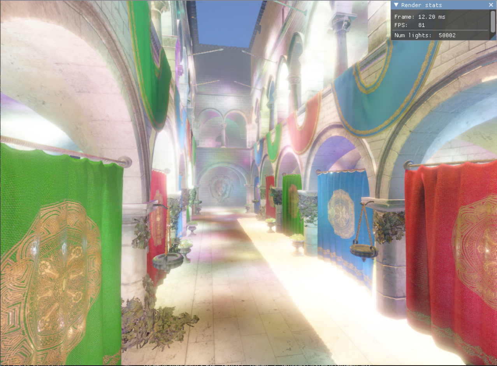

  
  
  

## Forward+ structure

Implemented classic forward+ structure, where everything is rendered in forward fashion but more optimized than classic Forward renderer. There are 3 main steps in that:
- <b>Depth Prepass</b> - Drawing depth information into a texture
- <b>Light culling</b> - Tile based culling, the screen is divided in tiles, and then for each tile using depth information from last step we calculate which lights are affecting that area of screen
- <b>Geometry rendering</b> - Rendering geometry in forward fashion using the light info from the last step and depth information from first step

### Performance

In the scene with a lot of lights only very small part of it will be rendered in the specific tile.
For example in the Sponza scene with 20k lights randomly placed around the map, most tiles will be calculating less than 30 lights. This is a huge gain, without this culling we would be calculating
10k lights per pixel instead of 30 lights per pixel. 
 

## Geometry culling

For the geometry culling we have 3 options, those are from slowest to fastest:
- <b>CPU_FrustumCulling</b> - Frustum culling performed on CPU
- <b>GPU_FrustumCulling</b> - Frustum culling performed on GPU with indirect draw generation
- <b>GPU_OcclusionCulling</b> - Occlusion culling performed on GPU with indirect draw generation. Currently using technique based on Hierarhical-Z buffer and Depth reprojection.

Culling is performed on beggining of the frame for both screen view and shadow views and is producing a visibility mask (bitfield) that will be used at later stages only to process visible geometries and generate indirect draws.

## Indirect drawing

Every geometry information is contained into 2 big buffers, one for the vertices, one for the indices.  
The data is divided into a 1 bindless texture array and 3 big structured buffers.  
The 1 texture array contains all the textures loaded into a scene.  
Those 3 buffers are:  
- <b> Mesh </b> - Details about the locations in the vertex and index buffer
- <b> Material </b> - Material information like factors, fresnel, and most importantly indexes of the textures in the texture array.
- <b> Drawable </b> - This buffer links information between data and objects in scene. It contains information about material index and mesh index. Also it contains the World transformation and bounding volume used in culling. We gather drawable index through push constant.
 

The first step for indirect drawing is to create argument buffer. Argument buffer contains DrawInstancedIndexed structure + one push constant that is referring to Drawable index.  
We are taking visibility mask from culling phase and using that to append drawcalls to an argument buffer.  
 
After that we call ExecuteIndirect that will draw everything.
 
In the real case scenario it is not that simple to have just one ExecuteIndirect for all. I've divided the calls by the geometries that needs special case of pipeline or shader and those groups are named *render groups*. Every render group has separate buffers for the vertices, materials and drawables, the only thing shared is the entity buffer. Also every render group has its own visibility mask.

Currently we are having 3 render groups for the Opaque, AlphaDiscard and Transparent geometry.

## Anti-aliasing

There are serveral implementations of the antialiasing from which you can choose in imgui. (Tools > Postprocessing)

- <b>Temporal Anti-aliasing(TAA)</b> - AA technique that is based on last frame data. It is implemented using motion vectors.
- <b>Multisample Anti-alising(MSAA)</b> - Classic AA technique that relies on directX api

## Bloom

Implementation of the bloom is inspired by Unity implementation. It works by 12 point linear downsampling, after that image is upsampled using combination of the high res downsampled image and lower res upsampled image with tent filter.

## Phisically based rendering

Renderer is using phisically based rendering. The formulas for PBR are inspired by [LearnOpenGL](https://learnopengl.com) site.  
It is also using IBL(Image based lighting) which means that the color of the skybox is also affecting overall color of the scene. This is an better alternative for ambient lights.

## Screen Space Ambient Occlusion (SSAO)

Calculating ambient occlusion in forward fashion only based on depth data. From the depth data we can get world position and reconstruct normals.  
The algorithm is based on sampling random directions from the position read from depth in the direction of the normal.  
If there is some geometry in some specified radius we count it as a occluded for that sample. We are using multiple samples (usually 64) and averaging results.  
After initial sampling ssao texture goes through blur fiter for better results.
