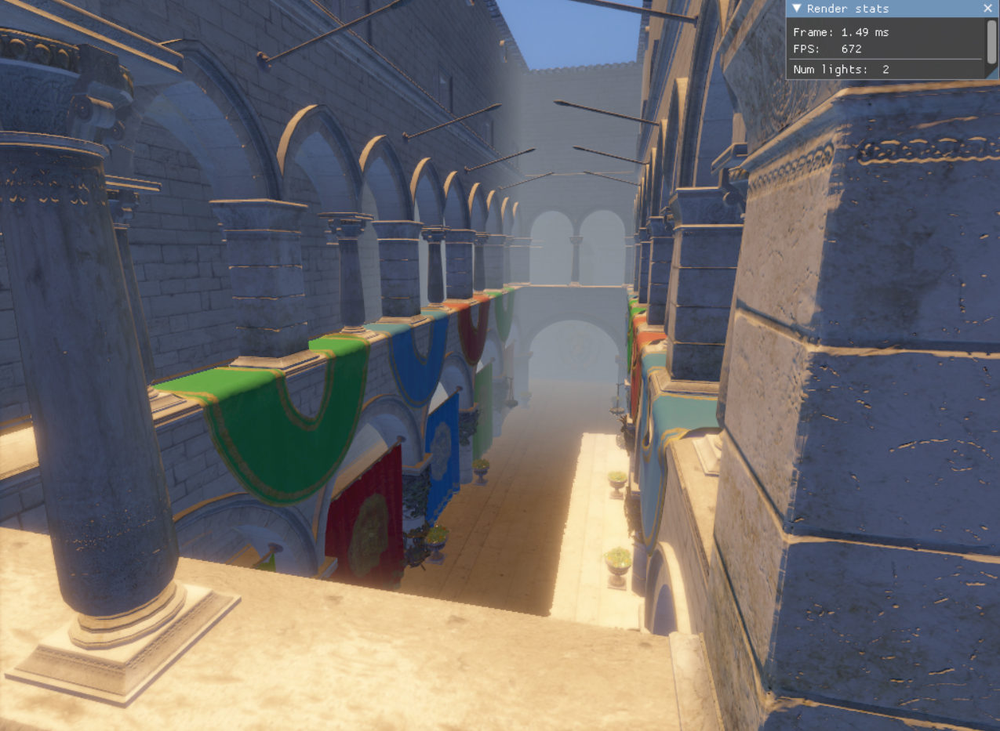

  
  
  

## Forward+ structure

Implemented classic forward+ structure, where everything is rendered in forward fashion but more optimized than classic Forward renderer. There are 3 main steps in that:
- <b>Depth Prepass</b> - Drawing depth information into a texture that will be used for an additional information what lights can be culled
- <b>Light culling</b> - Tile based culling, the screen is divided in tiles, and then for each tile using depth information from last step we calculate which lights are affecting that area of screen
- <b>Geometry rendering</b> - Rendering geometry in forward fashion using the light info from the last step

### Performance

The more lights we have in the scene the bigger the performance gain we get. In the scene with a lot of lights only very small part of it will be rendered in the specific tile.
For example in the Sponza scene with 10k lights randomly placed around the map, most tiles will be calculating less than 30 lights. This is a huge gain, without this culling we would be calculating
10k lights per pixel instead of 30 lights per pixel. 
 

## Geometry culling

For the geometry culling we are using just frustum culling with bounding spheres. Bounding spheres are calculated in the model loading phase and are in model space. When we are culling we are moving it to a world space where culling is performed.  
Culling is performed on CPU and is producing a visibility mask (bitfield) that will be used at later stages only to process visible geometries.

## Meshlets

The meshes in the scene are divided into subgroup of vertices that are next to each other. That subgroup is called Meshlet and it has maximum of 128 triangles. For the meshlet generation I used [DirectXMesh](https://github.com/microsoft/DirectXMesh) library. 
After geometry culling, we are culling remaining meshles by their meshlets, so at the end only visible parts of the mesh will be rendered.  
Also meshlets play major part in Batch drawing since we can instance draws that has maximum of 128 triangles.

## Batch drawing

Every geometry information is contained into 2 big buffers, one for the vertices, one for the indices. 
Also we can use existance of meshlets and the information that every part of mesh is 128 triangles to issue instanced calls.  
We are taking visibility mask that we got from culling phase and we are making instance buffer from it, where every element in that buffer is indexing one meshlet and its mesh.  
After that we can issue just one draw call for that instance buffer and every geometry will be drawn.

The data is divided into a 1 texture array and  4 big structured buffers, that are indexed through instance attribute DrawableInstance.  
The 1 texture array contains all the textures loaded into a scene.  
Those 4 buffers are:  
- <b> Mesh </b> - Details about the locations in the vertex and index buffer
- <b> Entity </b> - Geometry information. Currently it only contains model matrix.
- <b> Material </b> - Material information like factors, fresnel, and most importantly indexes of the textures in the texture array.
- <b> Drawable </b> - This buffer links information between data and vertex buffer. It contains information about entity index, material index and mesh index. We gather this drawable index from the vertex buffer.

Here is the graph of the data state on shader:

In the real case scenario it is not that simple to have just one batch draw for all. I've divided the batch calls by the geometries that needs special case of pipeline or shader and those groups are named render groups. Every render group has separate buffers for the vertices, materials and drawables, the only thing shared is the entity buffer. Also every render group has its own visibility mask.

Currently we are having 3 render groups for the Opaque, AlphaDiscard and Transparent geometry.

## Anti-aliasing

There are serveral implementations of the antialiasing from which you can choose in imgui. (Tools > Postprocessing)

- <b>Temporal Anti-aliasing(TAA)</b> - AA technique that is based on last frame data. It is implemented using motion vectors.
- <b>Multisample Anti-alising(MSAA)</b> - Classic AA technique that relies on directX api

## Bloom

Implementation of the bloom is inspired by Unity implementation. It works by 12 point linear downsampling, after that image is upsampled using combination of the high res downsampled image and lower res upsampled image with tent filter.
